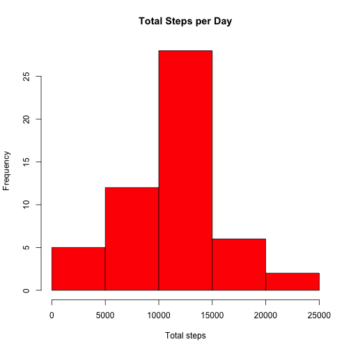
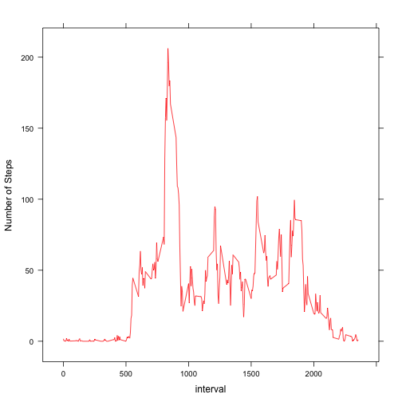
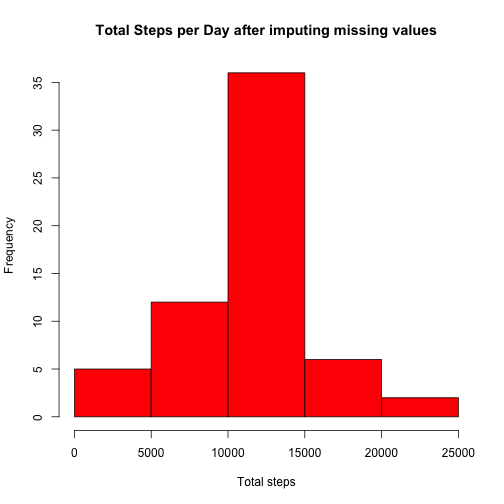
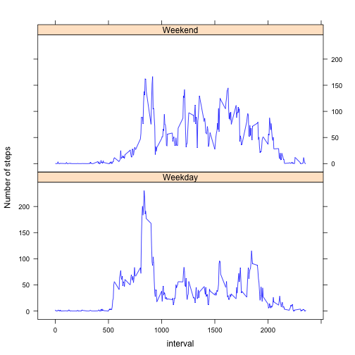

# Reproducible Research: Peer Assessment 1

```r
library(data.table)
library(lattice)
```

## Loading and preprocessing the data


```r
activity_zip <- "activity.zip"
activity_csv <- "activity.csv"

df <- read.csv(unz(activity_zip, activity_csv), header = TRUE, stringsAsFactors = FALSE, 
    colClasses = c("integer", "Date", "integer"))
```


## What is mean total number of steps taken per day?
### Make a histogram of the total number of steps taken each day
This part of the assignment ignores the missing values in the dataset by using the na.omit() function.

```r
dt <- data.table(na.omit(df))
by.date <- dt[, list(total = sum(steps)), by = date]
hist(by.date$total, freq = TRUE, col = "red", xlab = "Total steps", main = "Total Steps per Day")
```

 

### Calculate and report the mean and median total number of steps taken per day

```r
mean(by.date$total)
```

```
## [1] 10766
```

```r
median(by.date$total)
```

```
## [1] 10765
```


## What is the average daily activity pattern?

### Make a time series plot (i.e. type = "l") of the 5-minute interval (x-axis) and the average number of steps taken, averaged across all days (y-axis)

```r
by.interval <- dt[, list(avg.steps = mean(steps)), by = interval]
with(by.interval, {
    xyplot(avg.steps ~ interval, type = "l", col = "red", ylab = "Number of Steps")
})
```

 

### Show the 5-minute interval, on average across all the days in the dataset, that contains the maximum number of steps.


```r
by.interval[by.interval$avg.steps == max(by.interval$avg.steps), ]
```

```
##    interval avg.steps
## 1:      835     206.2
```


## Imputing missing values

## Calculate and report the total number of missing values in the dataset (i.e. the total number of rows with NAs)


```r
sum(!complete.cases(df))
```

```
## [1] 2304
```

### The strategy used for filling in the missing values in the dataset is to replace all the NA values with the average (mean) value of the number of steps for that time interval, as calculated above. The full dataset is loaded, merged with the average step value per interval and the NA step values are replaced with the average values. The code to implement this is shown here:

```r
new.df <- merge(df, by.interval, by = "interval")
new.df$steps[is.na(new.df$steps)] <- new.df$avg.steps[is.na(new.df$steps)]
```

### Make a histogram of the total number of steps taken each day after missing values were imputed.

```r
dt <- data.table(new.df)
by.date <- dt[, list(total = sum(steps)), by = date]
hist(by.date$total, freq = TRUE, col = "red", xlab = "Total steps", main = "Total Steps per Day after imputing missing values")
```

 

### and calculate and report the mean and median total number of steps taken per day:

```r
mean(by.date$total)
```

```
## [1] 10766
```

```r
median(by.date$total)
```

```
## [1] 10766
```


## Are there differences in activity patterns between weekdays and weekends?

### Create a new factor variable in the datset with two levels -- "weekday" and "weekend" indicating whether a given date is a weekday or weekend day

```r
new.df$weekend <- as.factor(ifelse(weekdays(new.df$date) %in% c("Monday", "Tuesday", 
    "Wednesday", "Thursday", "Friday"), "Weekday", "Weekend"))
```

### Make a panel plot containing a time series plot (i.e. type = "l") of the 5 minute interval (x-axis) and the average number of steps taken, averaged across all weekday days or weekend days (y-axis).

```r
dt1 <- data.table(new.df)
m.by.int <- dt1[, list(avg.steps = mean(steps)), by = c("interval", "weekend")]
with(m.by.int, {
    xyplot(avg.steps ~ interval | weekend, type = "l", col = "blue", layout = c(1, 
        2), ylab = "Number of steps")
})
```

 

